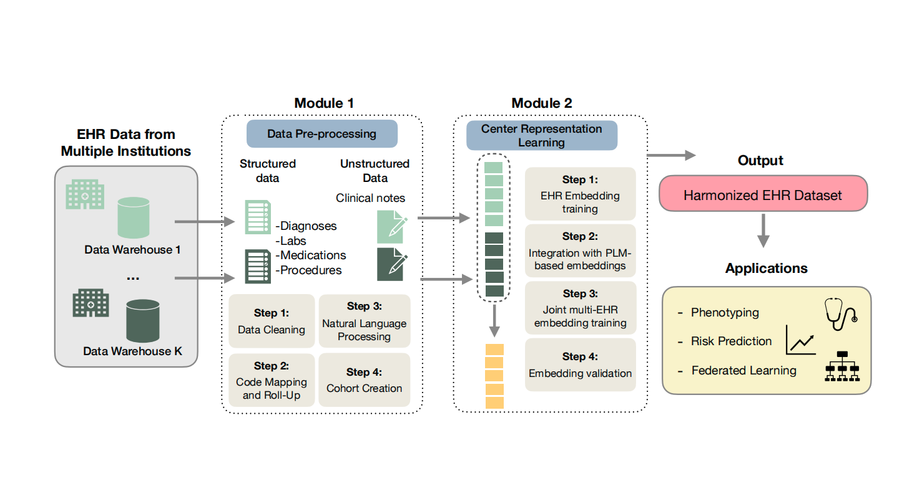

## What You Will Learn

This tutorial walks through the PEHRT framework for processing Electronic Health Record (EHR) data for translational research. It covers three modules:

1. **Module 1: Data Preprocessing** — Clean, normalize, and aggregate EHR data into analysis-ready patient-level feature matrices
2. **Module 2: Representation Learning** — Generate embeddings from EHR codes using SVD-PMI and pre-trained language models
3. **Module 3: Automated Harmonization** — Combine data from multiple institutions using the BONMI algorithm

{fig-align="center" width="98%"}

## Prerequisites

1. **Python basics** and familiarity with the Pandas library
2. **Access to MIMIC-IV 3.1** — see [MIMIC-IV Access](mimic-access.qmd)
3. **A [UMLS](https://www.nlm.nih.gov/research/umls/index.html) account** (needed for NLP processing in Module 1, Step 3)

## Tutorial Structure

Module 1 is divided into four parts:

- **Part 1: Data Cleaning**
- **Part 2: Medical Code Rollup**
- **Part 3: Natural Language Processing**
- **Part 4: Cohort Creation**

Each part walks through key steps using MIMIC-IV datasets as examples, then defines reusable functions that can be applied to other EHR datasets.

::: {.callout-tip}
## Quick Start
If you already have MIMIC-IV access and a workspace set up, skip to [Module 1](../module1/index.qmd).
:::

## Computing and Storage Requirements

The required resources depend on dataset scale:

| **Dataset Scale** | **Node Setup** | **CPU Cores** | **RAM** | **Storage** | **Notes** |
|----|----|---:|---:|----|----|
| **Moderate (~100K patients)** | Single node | 8–16 | 32–64 GB | ≥3x raw data | R/Python Pandas is sufficient |
| **Large (1–3M patients)** | Single powerful node | 32–64 | 256–512 GB | 3–5x raw data | Process in patient batches; consider Polars or Dask |
| **Large (1–3M patients)** | Distributed cluster (5–10 nodes) | 8–32 each | 64–128 GB each | 3–5x raw data | Prefer Parquet. Use Spark, Dask, Polars |
| **Very large (>5M patients)** | Single HPC node | ~128 | ~1 TB | 5x raw data | Use Spark or Dask on high-memory server |
| **Very large (>5M patients)** | Distributed HPC cluster (10–20 nodes) | ~32-64 each | ~128-256 GB each | 5x raw data | Use Parquet + scalable engine (Spark, Dask) |

## Software Recommendations

-   **Data Extraction and Cleaning:** Use **Python** for extracting and cleaning data from SQL databases.
-   **NLP Processing of Clinical Notes:** Tools like **NILE**, **cTAKES**, **HITEx**, **MedTagger**, **MetaMap**, **OBO Annotator**, or **Stanford CoreNLP** for NER and semantic analysis.
-   **Post-Processing:** **Pandas** for standard processing; **Dask/Polars** for parallel processing of large datasets.
